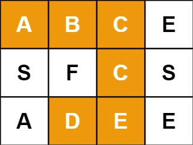
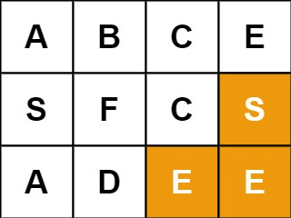
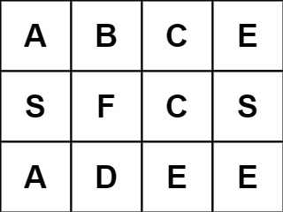

# 79. Word Search

Given an `m x n` grid of characters `board` and a string `word`, return `true` if `word` _exists in the grid_.

The word can be constructed from letters of sequentially adjacent cells, where adjacent cells are horizontally or vertically neighboring. The same letter cell may not be used more than once.

**Example 1:**

> Input: board = [["A","B","C","E"],["S","F","C","S"],["A","D","E","E"]], word = "ABCCED"  
> Output: true

**Example 2:**

> Input: board = [["A","B","C","E"],["S","F","C","S"],["A","D","E","E"]], word = "SEE"  
> Output: true  

**Example 3:**

> Input: board = [["A","B","C","E"],["S","F","C","S"],["A","D","E","E"]], word = "ABCB"  
> Output: false  

